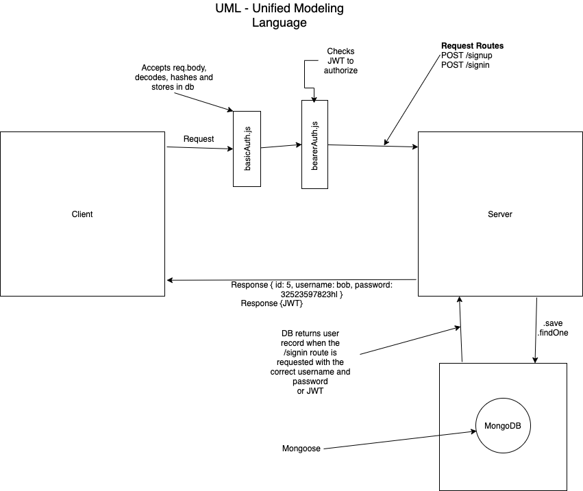

# LAB - 07

## Project: Bearer-Auth

### Author: Simon Panek

#### Contributors and Collaborators: Mariko, Ricardo, Nathan, Stacy

### Links and Resources

- [GitHub Actions](https://github.com/simon-panek/bearer-auth/actions) 
- [Heroku Deployment](https://simonpanek-bearer-auth.herokuapp.com/signup) 

### Setup

#### `.env` requirements (where applicable)

- `PORT` - 3000
- `MONGODB_URI` - mongodb://localhost:27017/auth2
- `SECRET` - dog

#### How to initialize/run your application (where applicable)

- `npm start`
- `npm test`
- Endpoints:
  - `/signup` - Takes a username and password and stores the to the DB.
  - `/signin` - Checks a username and password or token for a match in the DB, if valid allows access.

#### Tests

- Tests run on the basic-auth-middleware, bearer-auth-middleware, and router.

#### UML

